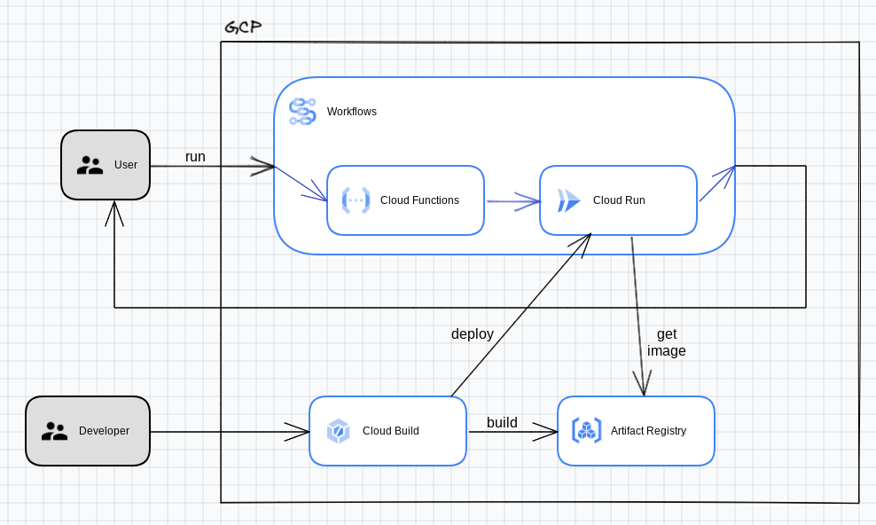

# Cloud Workflows with Cloud Function and Cloud Run
Simple Cloud Workflows example to execute in sequence a Cloud Function which generates a number, and then passed to a Cloud Run instance for the number to be multiplied by 2.


## Overall architecture




## Project structure
```
.
|-- README.md
|-- cloudbuild.yaml
|-- cloudfunctions.tf
|-- cmds.txt
|-- config.tf
|-- deploy.sh
|-- gar.tf
|-- iam.tf
|-- install.sh
|-- multiplyrun
|   |-- Dockerfile
|   `-- app.py
|-- randomgen
|   |-- 2d9cab30_randomgen.zip
|   |-- cloudfunction.tf
|   |-- main.py
|   |-- requirements.txt
|   `-- vars.tf
|-- terraform.tfstate
|-- terraform.tfstate.backup
|-- terraform.tfvars.json
|-- vars.tf
`-- workflow.tf

```


## Setup

1. Find out your GCP project's id and number from the dashboard in the cloud console, and update the following variables in the `terraform.tfvars.json` file. Replace `YOUR_PROJECT_NMR`, `YOUR_PROJECT_ID` and `YOUR_PROJECT_REGION` with the correct values. 


```shell
{
    "project_id": "YOUR_PROJECT_ID",
    "project_nmr": YOUR_PROJECT_NMR,
    "project_default_region": "YOUR_PROJECT_REGION"
}
```

## Install

1. Run the following command at the root of the folder:
```shell 
$ sudo ./install.sh
$ terraform init
$ terraform plan
$ terraform apply
```

> Note: You may have to run `terraform plan` and `terraform apply` twice if you get errors for serviceaccounts not found

2. Build and deploy the docker image in CloudRun service, by issuing the following command at the root of the project:

```shell
$ ./deploy.sh
```

3. Excecute the workload manually:

```shell
$ gcloud workflows run calc-workflow --project <project_id> --location <YOUR_PROJECT_REGION>
```